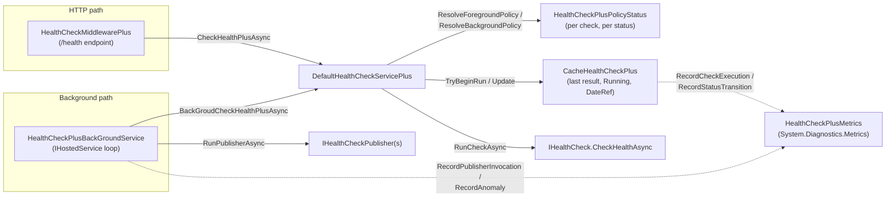

# HealthCheckPlus Architecture

This document describes how HealthCheckPlus is put together internally: what each component owns, how the two execution paths differ, and why several non-obvious design decisions were made the way they were. It's aimed at maintainers and contributors, not at consumers of the public API — for usage, see the [README](../README.md), and for a plain-language list of what to know before building on this library (without the internal "why"), see [`POINTS_OF_ATTENTION.md`](./POINTS_OF_ATTENTION.md).

This page stays at overview level - each of the four largest, most detail-heavy topics has its own page under [`docs/architecture/`](./architecture/) so this one stays a map, not a wall of text.

## Table of Contents

- [Product positioning](#product-positioning)
- [Core components](#core-components)
- [The two execution paths](#the-two-execution-paths)
- [Policy resolution](#policy-resolution)
- [Scheduling and the `Running` flag](./architecture/scheduling.md) *(own page)*
- [State: `CacheHealthCheckPlus` and `ItemCacheHealth`](./architecture/state.md) *(own page)*
- [Adopting external checks (`AddCheckLinkTo`)](#adopting-external-checks-addchecklinkto)
- [Publishing](./architecture/publishing.md) *(own page)*
- [Metrics](#metrics)
- [Logging and anomalies](./architecture/logging.md) *(own page)*
- [Extension points](#extension-points)

## Product positioning

HealthCheckPlus is a **policy and scheduling layer on top of ASP.NET Core's native health check system** (`Microsoft.Extensions.Diagnostics.HealthChecks`). It does not replace `IHealthCheck`, `HealthCheckRegistration`, or `HealthReport` — it wraps `HealthCheckService` with an implementation (`DefaultHealthCheckServicePlus`) that adds:

- Per-status polling policies (different delay/period depending on whether the last result was Healthy, Degraded, or Unhealthy).
- A cache of the last result per check, so a request doesn't necessarily re-run every check synchronously.
- An optional background service that polls checks on its own schedule and drives `IHealthCheckPublisher`s with extra filters (only publish on change, only publish every N idle cycles).
- A manual override (`SwitchToUnhealthy`/`SwitchToDegraded`) for cases where application code — not a poll — is the best signal that something is broken (e.g. a caught exception talking to a dependency).

Anything not explicitly overridden falls back to native ASP.NET Core behavior. A recurring design principle follows from this: prefer matching the native type/registration surface exactly over introducing HealthCheckPlus-specific replacements (see [Adopting external checks](#adopting-external-checks-addchecklinkto) below). **Benefit**: consumers keep using third-party `IHealthChecksBuilder` extensions and the native DI surface unmodified. **Point of attention**: where no public type exists to match against (see the native-service removal in [Publishing](./architecture/publishing.md)), the integration is inherently more fragile to future ASP.NET Core internal changes.

## Core components

| Component | Role |
|---|---|
| `DefaultHealthCheckServicePlus` | Replaces the native `HealthCheckService` singleton. Owns both execution paths (HTTP and background), policy resolution, and scheduling. |
| `CacheHealthCheckPlus` | Owns the actual state: last result, running flag, and timing per check. The single point every execution path converges on to read/write that state. |
| `HealthCheckPlusBackGroundService` | An `IHostedService` that polls on its own loop and drives publishers, replacing the native `HealthCheckPublisherHostedService`. |
| `HealthChecksPlusRegistrationState` | Per-`IServiceCollection` registration-time state (has `AddHealthChecksPlus` been called, cache of adopted external check instances). |
| `WrapperBaseHealthCheckPlus` | Wraps an externally-registered `IHealthCheck` (e.g. from a third-party `AddRedis()`-style package) so it can be adopted via `AddCheckLinkTo`. |
| `HealthCheckMiddlewarePlus` / `HealthChecksPlusAppExtension` | The HTTP endpoint (`UseHealthChecksPlus`), a thin wrapper that calls into `DefaultHealthCheckServicePlus.CheckHealthPlusAsync`. |
| `HealthCheckPlusMetrics` | Native `System.Diagnostics.Metrics` instrumentation (no OpenTelemetry SDK dependency). |
| `HealthCheckPlusPolicyStatus` | A registered policy: which status it applies to, its delay/period, and which check it targets. |

## The two execution paths

There are exactly two ways a check gets evaluated, and they deliberately behave differently in one respect (see [Policy resolution](#policy-resolution) below):

1. **Foreground / HTTP path** — `DefaultHealthCheckServicePlus.CheckHealthPlusAsync`, invoked by `HealthCheckMiddlewarePlus` on every request to a mapped `UseHealthChecksPlus` endpoint (tagged `HealthCheckTrigger.UrlRequest`). Also reachable directly via the overridden `HealthCheckService.CheckHealthAsync` (tagged `HealthCheckTrigger.Default`), which callers can resolve from DI like any other native health check service — both call sites share the same `ResolveForegroundPolicy` behavior, only the trigger tag differs.
2. **Background path** — `DefaultHealthCheckServicePlus.BackGroudCheckHealthPlusAsync` (tagged `HealthCheckTrigger.Background`), invoked by `HealthCheckPlusBackGroundService`'s own loop, on a timer independent of any HTTP traffic. Only active when `AddBackgroundPolicy()` was called.

Both paths share the same core logic, factored into a small set of methods used by both:

- `BuildDueRegistrations(registrations, resolvePolicy)` — resolves each candidate's policy (the only step that differs between the two paths - see [Policy resolution](#policy-resolution)) via `FindPolicy(name, status)` / `GetHealthyPolicy(name)`, then filters down to what's actually due via `ScheduleIfDue(item, policy, fallbackWhenNull)` (which atomically decides whether it's due - see [Scheduling](./architecture/scheduling.md)).
- `StartBatch(registrationsToRun, cancellationToken)` — fans every due registration out to its own `RunCheckAsync(registration, cancellationToken)` task, which invokes `IHealthCheck.CheckHealthAsync` with timeout and logging.
- `ApplyBatchResults(registrationsToRun, tasks, dtref, trigger, cancellationToken)` — once the batch settles, classifies each task's outcome (completed, genuinely cancelled by the ambient token, or failed) and applies it to the cache.

What differs between the foreground and background paths is **only** policy resolution (next section) and the trigger tag recorded on the result. **Benefit**: a fix or behavior change to scheduling, timeout handling, task classification, or logging is written once and automatically applies to both entry points. **Point of attention**: if a future change to one path's flow bypasses these shared methods, the two paths can silently diverge again — any change here should keep both paths going through the same shared methods.

## Policy resolution

`ResolveForegroundPolicy` and `ResolveBackgroundPolicy` decide which `HealthCheckPlusPolicyStatus` applies for a check's *current* last-known status, before checking whether it's due to run again.

- **Foreground (HTTP)**: `FindPolicy(name, lastStatus) ?? GetHealthyPolicy(name)`. If there's no explicit policy for the current status (e.g. no `AddUnhealthyPolicy` was registered), it falls back to the check's Healthy policy.
- **Background**: falls back instead to `HealthCheckPlusBackGroundOptions`' own per-status defaults (`HealthyPeriod`/`DegradedPeriod`/`UnhealthyPeriod`), which only exist when `AddBackgroundPolicy` was used.

This asymmetry is intentional, not an oversight: the background service has its own natural place to hold "what should the default cadence be" (its own options object), while the foreground path has no equivalent construct to fall back to other than the check's own Healthy policy. **Point of attention**: a single inline conditional that tries to handle both paths' fallback behavior at once is an easy way to accidentally conflate them — keeping `ResolveForegroundPolicy` and `ResolveBackgroundPolicy` as separate, clearly-named methods makes the difference a visible design choice instead of something a future edit can blur without noticing.

A check with **no Healthy policy at all** (e.g. registered via a native `IHealthChecksBuilder` extension without going through `AddCheckPlus`/`AddCheckLinkTo`) fails fast: `DefaultHealthCheckServicePlus`'s constructor calls `ValidateHealthyPolicies`, which throws `InvalidOperationException` naming every check missing one. **Benefit**: a misconfigured check is caught at startup, with a clear message naming it, instead of surfacing as a null-reference failure the first time health is evaluated. **Point of attention**: this is a deliberate fail-fast choice, not a defensive afterthought — a consumer relying on native `IHealthChecksBuilder` registration alone must also register a Healthy policy (`AddCheckPlus`/`AddCheckLinkTo`) or the host will refuse to start.

The same constructor also validates the opposite direction: `ValidatePolicyTargets` throws if a policy (`AddUnhealthyPolicy`/`AddDegradedPolicy`/`AddCheckPlus`/`AddCheckLinkTo`) names a check that was never actually registered - the same ordinal-ignore-case comparison `FindPolicy` itself uses, so a typo or casing mismatch is caught at startup instead of silently registering a policy `FindPolicy` can never match against any real check.

## Scheduling and the Running flag

`ScheduleIfDue` decides, for one check, whether enough time has passed since its last run and — if so — marks it `Running` so a second concurrent caller doesn't also schedule it. `CacheHealthCheckPlus.TryBeginRun` makes that check-and-mark one atomic operation under a lock, closing a race that used to let two concurrent callers (an HTTP request and a background cycle, or two concurrent requests) both schedule and run the same check. All scheduling comparisons use `DateTime.UtcNow`, never local time, so a non-UTC system clock or a DST transition can't cause drift or double-firing.

See [Scheduling and the `Running` flag](./architecture/scheduling.md) for the race's history, the `TryBeginRun` lock, how its scope grew to cover more than scheduling, the accepted per-cycle cost of `BuildDueRegistrations` and `UpdateStatusName()`, and the `Running`-release ownership protocol every execution path must honor.

## State: `CacheHealthCheckPlus` and `ItemCacheHealth`

`CacheHealthCheckPlus` holds one `ItemCacheHealth` per registered check name, seeded `Healthy` at startup, and implements the public `IStateHealthChecksPlus` interface consumers use to read cached status or force a manual override (`SwitchToUnhealthy`/`SwitchToDegraded`). This cache is scoped per `IServiceCollection`, not process-wide, so multiple hosts in the same process stay fully isolated. `Update()` is the single point every execution path converges on to write a new result, with metric recording isolated (`SafeRecordMetric`) so a broken exporter can never break health evaluation.

See [State: `CacheHealthCheckPlus` and `ItemCacheHealth`](./architecture/state.md) for how named aggregates (`_statusName`) stay version-consistent under concurrent reads and writes, the reentrancy guard around a `StatusHealthReport` delegate calling back into `SwitchTo*`, and why `HealthReport.TotalDuration` deliberately differs between the HTTP and cache-read paths.

## Adopting external checks (`AddCheckLinkTo`)

A third-party package's own `IHealthChecksBuilder` extension (e.g. `AddRedis(...)`) registers a plain `HealthCheckRegistration` the native way. `AddCheckLinkTo(namedep, name)` adopts that registration under a new name (`namedep`) so it can carry a HealthCheckPlus policy, by hooking into `IServiceCollection.Configure<HealthCheckServiceOptions>` — the same public, documented Options pipeline the original registration used to get there. It removes the original registration and adds a replacement whose factory wraps the original check in `WrapperBaseHealthCheckPlus`.

Two details here that took more than one pass to get right:

- **Caching, not eager construction.** `WrapperBaseHealthCheckPlus` wraps the *already-constructed* external check instance so it can be reused across polling cycles instead of being reconstructed (and the previous instance disposed) on every call — reconstructing an external check like a database connection wrapper on every poll would be wasteful and, worse, used to dispose the shared instance mid-use.
- **Single construction under concurrency.** The wrapper is cached in `HealthChecksPlusRegistrationState.ExternalCheck`, a `ConcurrentDictionary<string, Lazy<WrapperBaseHealthCheckPlus>>`. It's `Lazy<T>`, not the wrapper type directly, because `ConcurrentDictionary.GetOrAdd`'s value factory has no once-only guarantee under contention — two concurrent first-time callers could otherwise each construct a real underlying instance, with the loser silently discarded (and never disposed). `Lazy<T>`'s default thread-safety mode (`ExecutionAndPublication`) guarantees the inner factory runs exactly once even if `GetOrAdd`'s own (side-effect-free) factory runs more than once.
- **Disposal.** `DefaultHealthCheckServicePlus` is a container-managed singleton (registered via `TryAddSingleton<HealthCheckService, DefaultHealthCheckServicePlus>()` - an implementation-type registration, so the container itself constructs it), so the container disposes it automatically at shutdown — unlike `HealthChecksPlusRegistrationState` itself, which is registered as a ready-made instance and therefore is *not* auto-disposed (documented .NET DI behavior). `DefaultHealthCheckServicePlus.Dispose()` disposes every adopted check whose `Lazy<T>` was actually evaluated (`IsValueCreated`), and — because a consumer-supplied `IDisposable.Dispose()` can itself throw (e.g. a connection multiplexer failing because its socket was already force-closed) — does so with per-item fault isolation: one throwing `Dispose()` logs a Warning and a `healthcheckplus.anomalies` metric (`adopted_check_dispose_failed`) but does not stop the remaining checks from being disposed.

## Publishing

When `AddBackgroundPolicy` is used, `HealthCheckPlusBackGroundService` removes the native `HealthCheckPublisherHostedService` (so publishers aren't driven twice) and drives every registered `IHealthCheckPublisher` itself, after each polling cycle, subject to two extra filters (`AfterIdleCount`, `WhenReportChange`) plus an optional custom `PublisherCondition`. **Point of attention**: `PublishingOptions.Enabled` defaults to `false` — registering a publisher and calling `AddBackgroundPolicy` alone does not dispatch it.

See [Publishing](./architecture/publishing.md) for why the native-service removal is order-dependent (call `AddBackgroundPolicy` after every health check registration), how a chronically-failing publisher still incurs an ongoing re-dispatch cost, how each publisher invocation and the report build feeding it are fault-isolated from the rest of the loop, and how `InitCache`'s seed data is kept out of what gets published.

## Metrics

`HealthCheckPlusMetrics` is a static class exposing a `Meter` named `"HealthCheckPlus"` via `System.Diagnostics.Metrics` — no OpenTelemetry SDK dependency, so any exporter (OTel, Prometheus, App Insights, ...) can consume it, and the project's no-third-party-NuGet-package rule for the main package (see `CONTRIBUTING.md`) is preserved.

| Instrument | Kind | Tags | Notes |
|---|---|---|---|
| `healthcheckplus.check.duration` | Histogram (`s`) | `healthcheckplus.check.name`, `healthcheckplus.check.status`, `healthcheckplus.check.origin` | Excludes `HealthCheckTrigger.SwitchTo` (no code ran). |
| `healthcheckplus.check.executions` | Counter | same as above | Same exclusion. |
| `healthcheckplus.check.status_transitions` | Counter | `healthcheckplus.check.name`, `healthcheckplus.check.previous_status`, `healthcheckplus.check.status` | Fires on **any** status change, including `SwitchTo`. No-op if the status didn't actually change. |
| `healthcheckplus.publisher.invocations` | Counter | `healthcheckplus.publisher.type`, `healthcheckplus.publisher.result` | `healthcheckplus.publisher.result` is a closed set (`published`, `skipped_no_change`, `skipped_condition`, `error`) — an internal enum (`PublisherInvocationResult`) maps to the wire string only inside the recording method, so a call site can't emit an undocumented value. |
| `healthcheckplus.publisher.duration` | Histogram (`s`) | `healthcheckplus.publisher.type` | |
| `healthcheckplus.anomalies` | Counter | `healthcheckplus.anomaly.reason` | Internal defensive paths that were handled without failing the caller (see [Logging and anomalies](./architecture/logging.md)) — a rate/trend signal to alert on, complementing the Warning logs. One reason, `logging_sink_failed`, is the exception: it has no matching log, by design. |

Tag values are restricted to closed, known sets (check names, publisher type names, status/origin enums) — never exception messages or otherwise unbounded strings, to keep cardinality predictable for exporters.

A shutdown-time cancellation in `RunPublisherAsync` (the app is stopping, not a real failure) deliberately records **no** metric and **no** log, mirroring ASP.NET Core's own `HealthCheckPublisherHostedService` behavior — this is the one place `healthcheckplus.publisher.invocations` intentionally under-counts, since a graceful-shutdown cancellation isn't an operational failure worth an operator seeing counted.

## Logging and anomalies

The library uses the standard `[LoggerMessage]` source-generated logging pattern throughout, with a family of Warning-level logs for **defensive paths that were handled without failing the caller** — most paired with a `healthcheckplus.anomalies` metric. Nearly every log call across `CacheHealthCheckPlus`, `DefaultHealthCheckServicePlus`, and `HealthCheckPlusBackGroundService` goes through a shared `SafeLog` guard, so a broken `ILogger` sink can never kill the background loop, break `Dispose`/`StopAsync`, or turn a successful check into a 500 on `/health`.

See [Logging and anomalies](./architecture/logging.md) for the full log/anomaly catalog (including which ones are Critical or deliberately un-paired with a metric), the accepted `BeginScope` and simultaneous-sink-and-metric-failure gaps, and the project's no-silent-catch doctrine.

## Extension points

- **Custom health checks**: `AddCheckPlus<T>(name, delay?, period?, ...)` — standard `IHealthCheck`, registered with a Healthy policy.
- **External/third-party health checks**: `AddCheckLinkTo(namedep, name, delay?, period?)` — adopts an existing registration (see above).
- **Per-status policies**: `AddUnhealthyPolicy(name, period)`, `AddDegradedPolicy(name, period)` (Healthy policy comes from `AddCheckPlus`/`AddCheckLinkTo` directly).
- **Background polling**: `AddBackgroundPolicy(Action<HealthCheckPlusBackGroundOptions>?)`.
- **Publishers**: implement `IHealthCheckPublisher` (native) and optionally `IHealthCheckPlusPublisher` for a custom `PublisherCondition`.
- **HTTP endpoint**: `UseHealthChecksPlus(path, [port], [HealthCheckPlusOptions])` — response templates (`WriteShortDetails`, `WriteDetailsWithoutException`, `WriteDetailsWithException`, and their `...Plus` variants with cache-source/reference-date fields) live on `HealthCheckPlusOptions`.
- **Manual overrides**: `IStateHealthChecksPlus.SwitchToUnhealthy`/`SwitchToDegraded`, resolved from DI, for application code that detects a failure outside of a poll (e.g. a caught exception from a dependency call).
