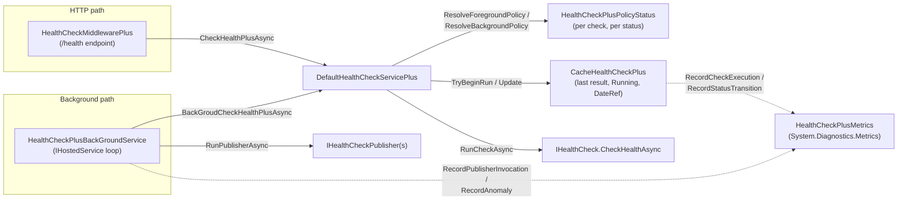

# HealthCheckPlus Architecture

This document describes how HealthCheckPlus is put together internally: what each component owns, how the two execution paths differ, and why several non-obvious design decisions were made the way they were. It's aimed at maintainers and contributors, not at consumers of the public API — for usage, see the [README](../README.md).

## Product positioning

HealthCheckPlus is a **policy and scheduling layer on top of ASP.NET Core's native health check system** (`Microsoft.Extensions.Diagnostics.HealthChecks`). It does not replace `IHealthCheck`, `HealthCheckRegistration`, or `HealthReport` — it wraps `HealthCheckService` with an implementation (`DefaultHealthCheckServicePlus`) that adds:

- Per-status polling policies (different delay/period depending on whether the last result was Healthy, Degraded, or Unhealthy).
- A cache of the last result per check, so a request doesn't necessarily re-run every check synchronously.
- An optional background service that polls checks on its own schedule and drives `IHealthCheckPublisher`s with extra filters (only publish on change, only publish every N idle cycles).
- A manual override (`SwitchToUnhealthy`/`SwitchToDegraded`) for cases where application code — not a poll — is the best signal that something is broken (e.g. a caught exception talking to a dependency).

Anything not explicitly overridden falls back to native ASP.NET Core behavior. A recurring design principle follows from this: prefer matching the native type/registration surface exactly over introducing HealthCheckPlus-specific replacements (see [Adopting external checks](#adopting-external-checks-addchecklinkto) below). **Benefit**: consumers keep using third-party `IHealthChecksBuilder` extensions and the native DI surface unmodified. **Point of attention**: where no public type exists to match against (see the background publisher removal below), the integration is inherently more fragile to future ASP.NET Core internal changes.

## Core components

| Component | Role |
|---|---|
| `DefaultHealthCheckServicePlus` | Replaces the native `HealthCheckService` singleton. Owns both execution paths (HTTP and background), policy resolution, and scheduling. |
| `CacheHealthCheckPlus` | Owns the actual state: last result, running flag, and timing per check. The single point every execution path converges on to read/write that state. |
| `HealthCheckPlusBackGroundService` | An `IHostedService` that polls on its own loop and drives publishers, replacing the native `HealthCheckPublisherHostedService`. |
| `HealthChecksPlusRegistrationState` | Per-`IServiceCollection` registration-time state (has `AddHealthChecksPlus` been called, cache of adopted external check instances). |
| `WrapperBaseHealthCheckPlus` | Wraps an externally-registered `IHealthCheck` (e.g. from a third-party `AddRedis()`-style package) so it can be adopted via `AddCheckLinkTo`. |
| `HealthCheckMiddlewarePlus` / `HealthChecksPlusAppExtension` | The HTTP endpoint (`UseHealthChecksPlus`), a thin wrapper that calls into `DefaultHealthCheckServicePlus.CheckHealthPlusAsync`. |
| `HealthCheckPlusMetrics` | Native `System.Diagnostics.Metrics` instrumentation (no OpenTelemetry SDK dependency). |
| `HealthCheckPlusPolicyStatus` | A registered policy: which status it applies to, its delay/period, and which check it targets. |



## The two execution paths

There are exactly two ways a check gets evaluated, and they deliberately behave differently in one respect (see [Policy resolution](#policy-resolution) below):

1. **Foreground / HTTP path** — `DefaultHealthCheckServicePlus.CheckHealthPlusAsync`, invoked by `HealthCheckMiddlewarePlus` on every request to a mapped `UseHealthChecksPlus` endpoint (tagged `HealthCheckTrigger.UrlRequest`). Also reachable directly via the overridden `HealthCheckService.CheckHealthAsync` (tagged `HealthCheckTrigger.Default`), which callers can resolve from DI like any other native health check service — both call sites share the same `ResolveForegroundPolicy` behavior, only the trigger tag differs.
2. **Background path** — `DefaultHealthCheckServicePlus.BackGroudCheckHealthPlusAsync` (tagged `HealthCheckTrigger.Background`), invoked by `HealthCheckPlusBackGroundService`'s own loop, on a timer independent of any HTTP traffic. Only active when `AddBackgroundPolicy()` was called.

Both paths share the same core logic, factored into a small set of methods used by both:

- `BuildDueRegistrations(registrations, resolvePolicy)` — resolves each candidate's policy (the only step that differs between the two paths - see [Policy resolution](#policy-resolution)) via `FindPolicy(name, status)` / `GetHealthyPolicy(name)`, then filters down to what's actually due via `ScheduleIfDue(item, policy, fallbackWhenNull)` (which atomically decides whether it's due - see [Scheduling](#scheduling-and-the-running-flag)).
- `StartBatch(registrationsToRun, cancellationToken)` — fans every due registration out to its own `RunCheckAsync(registration, cancellationToken)` task, which invokes `IHealthCheck.CheckHealthAsync` with timeout and logging.
- `ApplyBatchResults(registrationsToRun, tasks, dtref, trigger, cancellationToken)` — once the batch settles, classifies each task's outcome (completed, genuinely cancelled by the ambient token, or failed) and applies it to the cache.

What differs between the foreground and background paths is **only** policy resolution (next section) and the trigger tag recorded on the result. **Benefit**: a fix or behavior change to scheduling, timeout handling, task classification, or logging is written once and automatically applies to both entry points. **Point of attention**: if a future change to one path's flow bypasses these shared methods, the two paths can silently diverge again — any change here should keep both paths going through the same shared methods.

## Policy resolution

`ResolveForegroundPolicy` and `ResolveBackgroundPolicy` decide which `HealthCheckPlusPolicyStatus` applies for a check's *current* last-known status, before checking whether it's due to run again.

- **Foreground (HTTP)**: `FindPolicy(name, lastStatus) ?? GetHealthyPolicy(name)`. If there's no explicit policy for the current status (e.g. no `AddUnhealthyPolicy` was registered), it falls back to the check's Healthy policy.
- **Background**: falls back instead to `HealthCheckPlusBackGroundOptions`' own per-status defaults (`HealthyPeriod`/`DegradedPeriod`/`UnhealthyPeriod`), which only exist when `AddBackgroundPolicy` was used.

This asymmetry is intentional, not an oversight: the background service has its own natural place to hold "what should the default cadence be" (its own options object), while the foreground path has no equivalent construct to fall back to other than the check's own Healthy policy. **Point of attention**: a single inline conditional that tries to handle both paths' fallback behavior at once is an easy way to accidentally conflate them — keeping `ResolveForegroundPolicy` and `ResolveBackgroundPolicy` as separate, clearly-named methods makes the difference a visible design choice instead of something a future edit can blur without noticing.

A check with **no Healthy policy at all** (e.g. registered via a native `IHealthChecksBuilder` extension without going through `AddCheckPlus`/`AddCheckLinkTo`) fails fast: `DefaultHealthCheckServicePlus`'s constructor calls `ValidateHealthyPolicies`, which throws `InvalidOperationException` naming every check missing one. **Benefit**: a misconfigured check is caught at startup, with a clear message naming it, instead of surfacing as a null-reference failure the first time health is evaluated. **Point of attention**: this is a deliberate fail-fast choice, not a defensive afterthought — a consumer relying on native `IHealthChecksBuilder` registration alone must also register a Healthy policy (`AddCheckPlus`/`AddCheckLinkTo`) or the host will refuse to start.

## Scheduling and the Running flag

`ScheduleIfDue` decides, for one check, whether enough time has passed since its last run (`DateRef` + the resolved policy's Delay/Period, compared to `DateTime.UtcNow`) and — if so — marks it `Running` so a second concurrent caller doesn't also schedule it.

The due-check and the Running-flag write used to be two separate, unsynchronized steps. Two callers evaluating the same check at nearly the same instant (an HTTP request and a background cycle, or two concurrent HTTP requests) could both observe "not running, due" before either one had a chance to mark it, both schedule the same check, and run it concurrently — with whichever finished last having its result silently discarded by `CacheHealthCheckPlus.Update` (which requires `Running == true` to accept a result).

`CacheHealthCheckPlus.TryBeginRun(key, isDue)` closes this by making the check and the mark one atomic operation, guarded by a lock:

```csharp
public bool TryBeginRun(string key, Func<ItemCacheHealth, bool> isDue)
{
    lock (_lock)
    {
        if (!_statusDeps.TryGetValue(key, out var item) || item.Running || !isDue(item))
        {
            return false;
        }
        item.Running = true;
        return true;
    }
}
```

`isDue` is evaluated *inside* the lock, against the live cache item, so there is no window between "check" and "mark" for another caller to slip through. This is a coarse-grained (single, class-wide) lock rather than one lock per check — deliberately, since scheduling decisions are infrequent (once per poll interval per check, not a hot path) and a per-key lock table would add complexity without a measurable benefit at this call frequency.

All scheduling comparisons use `DateTime.UtcNow`, never local time — **point of attention**: a host running with a non-UTC system clock (or one that observes a DST transition) must not see check periods drift or double-fire; comparing against UTC consistently avoids that class of bug entirely.

## State: `CacheHealthCheckPlus` and `ItemCacheHealth`

`CacheHealthCheckPlus` holds one `ItemCacheHealth` per registered check name (`Name`, `LastResult`, `DateRef`, `Duration`, `Origin`, `Running`), seeded by `InitCache` at startup with `HealthStatus.Healthy`. It implements the public `IStateHealthChecksPlus` interface, which is how application code reads cached status directly (`Status()`, `StatusResult()`, `TryGetUnhealthy()`, etc.) or forces a manual override (`SwitchToUnhealthy`/`SwitchToDegraded`, backed by `SwithState`).

This cache — along with `HealthChecksPlusRegistrationState` (registration-time flags and adopted-check instances) — is scoped per `IServiceCollection`, not process-wide. **Benefit**: multiple hosts built in the same process (`WebApplicationFactory`-style integration tests, .NET Aspire, parallel test runs) each get fully isolated health-check state; a check registered in one host can never leak its cached status, or its adopted external check instance, into another. **Point of attention**: code that needs to read this state (e.g. a custom middleware or background job) must resolve `IStateHealthChecksPlus` from that same host's DI container — there is no global accessor.

`Update(key, trigger, result, lastExecute, duration)` is the single point every execution path — foreground, background, and the manual `SwitchTo` override — converges on to write a new result. Two things worth knowing about it:

- It **drops** the update (logging a Warning, `HealthCheckPlusUpdateDropped`, and recording a `healthcheckplus.anomalies` metric with reason `update_result_dropped`) if the key isn't registered, or if `Running` isn't already `true` for it. The latter is reachable under the same overlapping-execution scenario `TryBeginRun` above guards against at the *scheduling* stage — this is the *safety net* if two runs somehow still overlap (e.g. a manually-triggered check racing a scheduled one).
- Metric recording (`RecordStatusTransition`/`RecordCheckExecution`) is wrapped in its own try/catch (`SafeRecordMetric`), because a `MeterListener` callback (e.g. a third-party OTel exporter with a bug) runs synchronously on the calling thread — an uncaught throw there would otherwise propagate out of `Update()` and, on the HTTP path, turn an instrumentation failure into a 500 response. **Metrics must never be able to break health evaluation.**

`HealthCheckTrigger.SwitchTo` (the manual override) is recorded as a status transition but deliberately excluded from `RecordCheckExecution`/duration metrics — no code actually ran, so it isn't an "execution."

## Adopting external checks (`AddCheckLinkTo`)

A third-party package's own `IHealthChecksBuilder` extension (e.g. `AddRedis(...)`) registers a plain `HealthCheckRegistration` the native way. `AddCheckLinkTo(namedep, name)` adopts that registration under a new name (`namedep`) so it can carry a HealthCheckPlus policy, by hooking into `IServiceCollection.Configure<HealthCheckServiceOptions>` — the same public, documented Options pipeline the original registration used to get there. It removes the original registration and adds a replacement whose factory wraps the original check in `WrapperBaseHealthCheckPlus`.

Two details here that took more than one pass to get right:

- **Caching, not eager construction.** `WrapperBaseHealthCheckPlus` wraps the *already-constructed* external check instance so it can be reused across polling cycles instead of being reconstructed (and the previous instance disposed) on every call — reconstructing an external check like a database connection wrapper on every poll would be wasteful and, worse, used to dispose the shared instance mid-use.
- **Single construction under concurrency.** The wrapper is cached in `HealthChecksPlusRegistrationState.ExternalCheck`, a `ConcurrentDictionary<string, Lazy<WrapperBaseHealthCheckPlus>>`. It's `Lazy<T>`, not the wrapper type directly, because `ConcurrentDictionary.GetOrAdd`'s value factory has no once-only guarantee under contention — two concurrent first-time callers could otherwise each construct a real underlying instance, with the loser silently discarded (and never disposed). `Lazy<T>`'s default thread-safety mode (`ExecutionAndPublication`) guarantees the inner factory runs exactly once even if `GetOrAdd`'s own (side-effect-free) factory runs more than once.
- **Disposal.** `DefaultHealthCheckServicePlus` is a container-managed singleton (registered via `TryAddSingleton`, a factory registration), so the container disposes it automatically at shutdown — unlike `HealthChecksPlusRegistrationState` itself, which is registered as a ready-made instance and therefore is *not* auto-disposed (documented .NET DI behavior). `DefaultHealthCheckServicePlus.Dispose()` disposes every adopted check whose `Lazy<T>` was actually evaluated (`IsValueCreated`), and — because a consumer-supplied `IDisposable.Dispose()` can itself throw (e.g. a connection multiplexer failing because its socket was already force-closed) — does so with per-item fault isolation: one throwing `Dispose()` logs a Warning and a `healthcheckplus.anomalies` metric (`adopted_check_dispose_failed`) but does not stop the remaining checks from being disposed.

## Publishing

When `AddBackgroundPolicy` is used, `HealthCheckPlusBackGroundService` removes the native `HealthCheckPublisherHostedService` (so publishers aren't driven twice) and drives every registered `IHealthCheckPublisher` itself, after each polling cycle, subject to two extra filters (`PublishingOptions`):

- **`AfterIdleCount`** — only publish every N idle cycles, not every cycle.
- **`WhenReportChange`** — only publish if the aggregate report actually changed since the last publish (compared via a hash of `{name+status}` pairs, `HashReport`). The last-published hash is a single value shared by every publisher, only updated after a cycle's publisher dispatch completes without throwing — so if one publisher is permanently broken (always throws), the hash never updates, and *every* publisher (including ones that succeeded) is re-dispatched the same unchanged report every `AfterIdleCount` cycles instead of just the broken one. This is a deliberate at-least-once tradeoff (a transient failure must not suppress a real, still-unpublished change) rather than a bug, but it means a chronically-failing publisher has an ongoing cost beyond its own repeated failures.
- A publisher can additionally implement `IHealthCheckPlusPublisher.PublisherCondition` for its own custom gating.

Each publisher invocation is fault-isolated (`RunPublisherAsync`): a publisher that throws is logged and recorded with `healthcheckplus.publisher.invocations{result=error}`, then the exception is rethrown so the *cycle* (not the whole background loop) sees it. The cycle-level dispatch (`await Task.WhenAll(tasks)` over all publishers) is itself wrapped in a try/catch that logs `HealthCheckPublisherCycleError` (Warning) and records a `publisher_cycle_failed_but_continued` anomaly. **Point of attention**: without this outer try/catch, a single publisher throwing once would permanently kill the entire background loop (checks *and* publishing) for the rest of the process's life, with no crash and no log — a scenario a happy-path publisher test won't catch, so a publisher that's expected to occasionally throw is worth testing explicitly against this exact behavior.

## Metrics

`HealthCheckPlusMetrics` is a static class exposing a `Meter` named `"HealthCheckPlus"` via `System.Diagnostics.Metrics` — no OpenTelemetry SDK dependency, so any exporter (OTel, Prometheus, App Insights, ...) can consume it, and the project's zero-external-dependency rule for the main package is preserved.

| Instrument | Kind | Tags | Notes |
|---|---|---|---|
| `healthcheckplus.check.duration` | Histogram (`s`) | `check.name`, `check.status`, `check.origin` | Excludes `HealthCheckTrigger.SwitchTo` (no code ran). |
| `healthcheckplus.check.executions` | Counter | same as above | Same exclusion. |
| `healthcheckplus.check.status_transitions` | Counter | `check.name`, `previous_status`, `status` | Fires on **any** status change, including `SwitchTo`. No-op if the status didn't actually change. |
| `healthcheckplus.publisher.invocations` | Counter | `publisher.type`, `result` | `result` is a closed set (`published`, `skipped_no_change`, `skipped_condition`, `error`) — an internal enum (`PublisherInvocationResult`) maps to the wire string only inside the recording method, so a call site can't emit an undocumented value. |
| `healthcheckplus.publisher.duration` | Histogram (`s`) | `publisher.type` | |
| `healthcheckplus.anomalies` | Counter | `anomaly.reason` | Internal defensive paths that were handled without failing the caller (see [Logging and anomalies](#logging-and-anomalies) below) — a rate/trend signal to alert on, complementing the Warning logs. |

Tag values are restricted to closed, known sets (check names, publisher type names, status/origin enums) — never exception messages or otherwise unbounded strings, to keep cardinality predictable for exporters.

A shutdown-time cancellation in `RunPublisherAsync` (the app is stopping, not a real failure) deliberately records **no** metric and **no** log, mirroring ASP.NET Core's own `HealthCheckPublisherHostedService` behavior — this is the one place `healthcheckplus.publisher.invocations` intentionally under-counts, since a graceful-shutdown cancellation isn't an operational failure worth an operator seeing counted.

## Logging and anomalies

The library uses the standard `[LoggerMessage]` source-generated logging pattern throughout, with hard-coded `EventId`/`EventName` pairs per class (so renaming a method never changes what shows up in logs). Beyond the routine begin/end/error logs around check and publisher execution, there is a specific family of Warning-level logs for **defensive paths that were handled without failing the caller** — every one of them is paired with a `healthcheckplus.anomalies` metric (see above), except where recording the metric would itself be circular:

- `HealthCheckPublisherCycleError` — a publisher failed this cycle; the loop is continuing.
- `HealthCheckDisposeError` — an adopted check's `Dispose()` threw; the remaining checks are still being disposed.
- `HealthCheckPlusUpdateDropped` — `Update()`'s result was dropped (unregistered key, or an overlapping execution already claimed `Running`).
- `HealthCheckExecutionAborted` — a scheduled check never actually completed because the ambient cancellation fired (an HTTP client disconnected, or a background-cycle Timeout elapsed) while it was still running — not the check itself failing. Its last known result (`LastResult`, `Duration`, `Origin`) is left untouched rather than overwritten with a synthetic one; only the scheduling state (`Running`, `DateRef`) is released, advancing `DateRef` to the abort time so it's retried on its normal schedule instead of hot-looping. This means `DateRef` can briefly read newer than the `LastResult`/`Duration`/`Origin` it's paired with in a report — see the `dateRef` caveat in `RUNBOOK.md`.
- `HealthCheckPlusMetricsRecordingError` (in `CacheHealthCheckPlus`) / its two per-class siblings — recording a metric itself failed. **Not** paired with an anomaly metric: if the `Meter`'s own recording is what's broken, calling back into it to report that would be circular and could throw again for the same reason. This one stays log-only, by design.

None of these catch blocks are silent. A defensive `try/catch` that swallows an exception with no log and no metric — even a "best-effort, the outer log already covers it" one — is treated as a defect in this codebase, not a stylistic choice: every catch leaves some operator-visible trace of what happened.

## Extension points

- **Custom health checks**: `AddCheckPlus<T>(name, delay?, period?, ...)` — standard `IHealthCheck`, registered with a Healthy policy.
- **External/third-party health checks**: `AddCheckLinkTo(namedep, name, delay?, period?)` — adopts an existing registration (see above).
- **Per-status policies**: `AddUnhealthyPolicy(name, period)`, `AddDegradedPolicy(name, period)` (Healthy policy comes from `AddCheckPlus`/`AddCheckLinkTo` directly).
- **Background polling**: `AddBackgroundPolicy(Action<HealthCheckPlusBackGroundOptions>?)`.
- **Publishers**: implement `IHealthCheckPublisher` (native) and optionally `IHealthCheckPlusPublisher` for a custom `PublisherCondition`.
- **HTTP endpoint**: `UseHealthChecksPlus(path, [port], [HealthCheckPlusOptions])` — response templates (`WriteShortDetails`, `WriteDetailsWithException`, and their `...Plus` variants with cache-source/reference-date fields) live on `HealthCheckPlusOptions`.
- **Manual overrides**: `IStateHealthChecksPlus.SwitchToUnhealthy`/`SwitchToDegraded`, resolved from DI, for application code that detects a failure outside of a poll (e.g. a caught exception from a dependency call).
